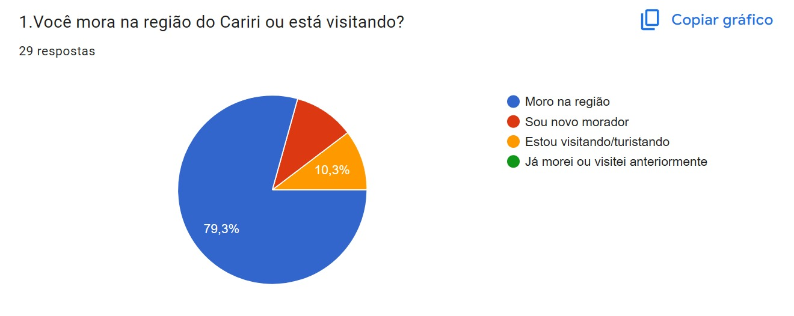
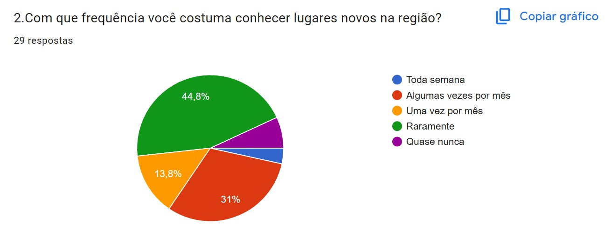
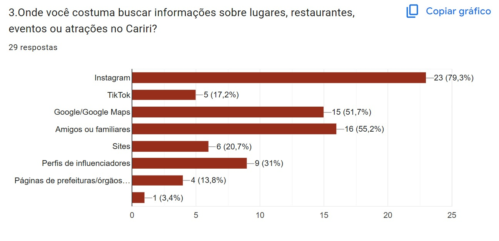
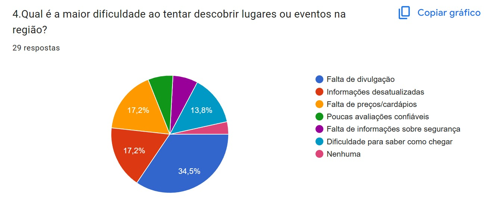
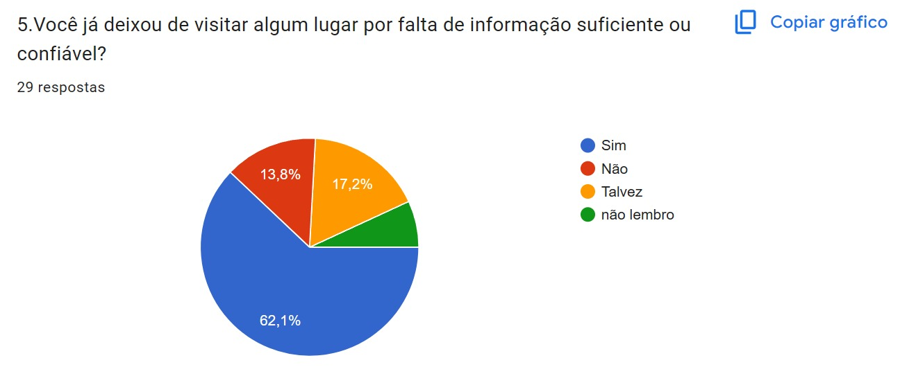
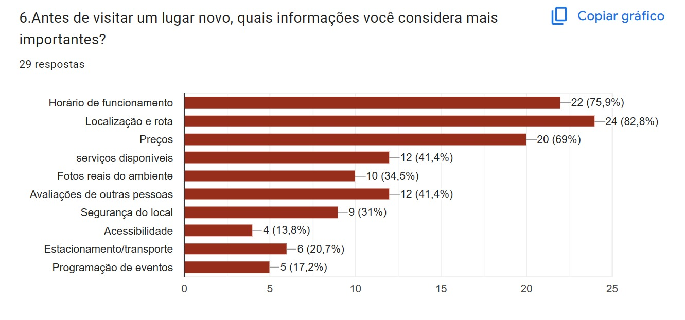
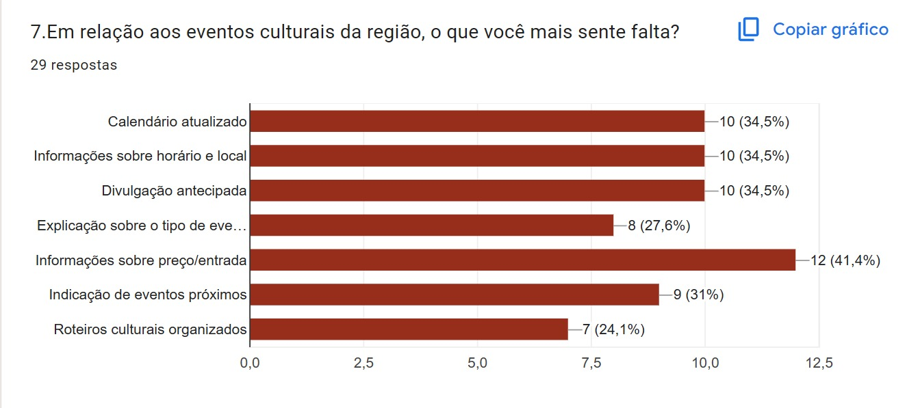
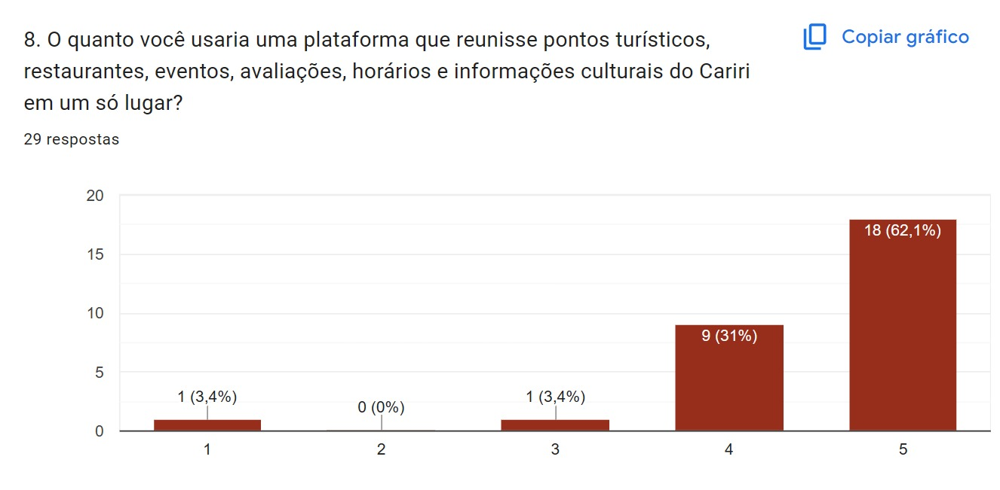
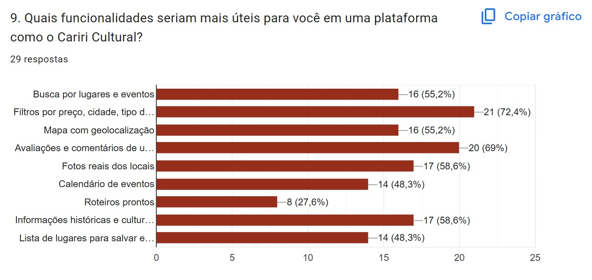
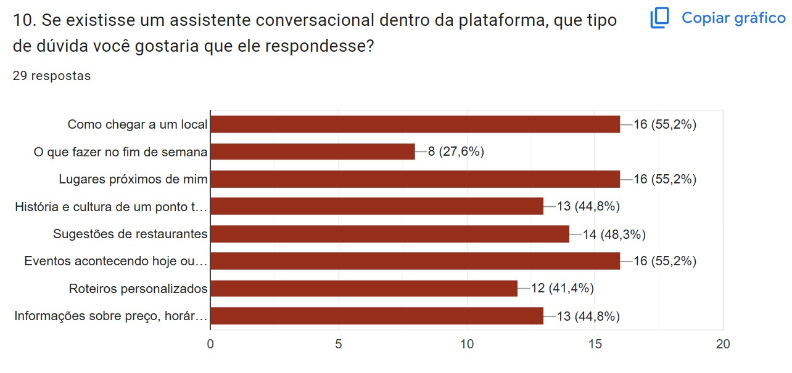

# Gráficos do Survey

---

## Gráfico 01 — Perfil dos respondentes

**Pergunta:** Você mora na região do Cariri ou está visitando?  
**Total de respostas:** 29.

**Análise:** A maioria dos respondentes mora na região, representando 79,3% das respostas. Isso indica que o survey teve forte participação de moradores locais, o que é importante para compreender as necessidades de quem convive frequentemente com a realidade turística, cultural e gastronômica do Cariri.

---

## Gráfico 02 — Frequência com que os respondentes conhecem lugares novos

**Pergunta:** Com que frequência você costuma conhecer lugares novos na região?  
**Total de respostas:** 29.

**Análise:** A maior parte dos respondentes conhece lugares novos raramente, com 44,8% das respostas. Em seguida, 31% afirmam conhecer lugares novos algumas vezes por mês e 13,8% uma vez por mês. Esse resultado mostra que existe interesse em conhecer novos locais, mas também indica que pode haver barreiras relacionadas à descoberta, divulgação ou planejamento dessas visitas.

---

## Gráfico 03 — Fontes usadas para buscar informações

**Pergunta:** Onde você costuma buscar informações sobre lugares, restaurantes, eventos ou atrações no Cariri?  
**Total de respostas:** 29.

**Análise:** O Instagram aparece como a principal fonte de informação, com 23 respostas, equivalente a 79,3%. Amigos ou familiares aparecem com 16 respostas, e Google/Google Maps com 15 respostas. Isso confirma a dependência dos usuários em relação a redes sociais, recomendações pessoais e ferramentas dispersas para descobrir lugares e eventos.

---

## Gráfico 04 — Maiores dificuldades para descobrir lugares ou eventos

**Pergunta:** Qual é a maior dificuldade ao tentar descobrir lugares ou eventos na região?  
**Total de respostas:** 29.

**Análise:** A falta de divulgação foi a dificuldade mais citada, com 34,5%. Também aparecem como problemas relevantes as informações desatualizadas, a falta de preços/cardápios e a dificuldade para saber como chegar. Esse resultado reforça a necessidade de uma plataforma que reúna informações organizadas, atualizadas e úteis para o planejamento da visita.

---

## Gráfico 05 — Desistência por falta de informação

**Pergunta:** Você já deixou de visitar algum lugar por falta de informação suficiente ou confiável?  
**Total de respostas:** 29.

**Análise:** A maioria dos respondentes, 62,1%, afirmou que já deixou de visitar algum lugar por falta de informação suficiente ou confiável. Esse dado confirma que a ausência de informações claras impacta diretamente a decisão de visita e fortalece a justificativa para uma solução centralizada e confiável.

---

## Gráfico 06 — Informações consideradas mais importantes antes da visita

**Pergunta:** Antes de visitar um lugar novo, quais informações você considera mais importantes?  
**Total de respostas:** 29.

**Análise:** As informações mais importantes foram localização e rota, com 24 respostas, horário de funcionamento, com 22 respostas, e preços, com 20 respostas. Também aparecem avaliações, serviços disponíveis, fotos reais do ambiente, segurança, transporte e programação de eventos. Isso indica que os usuários precisam de informações práticas antes da visita.

---

## Gráfico 07 — Necessidades relacionadas a eventos culturais

**Pergunta:** Em relação aos eventos culturais da região, o que você mais sente falta?  
**Total de respostas:** 29.

**Análise:** A informação sobre preço/entrada foi a mais citada, com 12 respostas. Calendário atualizado, informações sobre horário e local e divulgação antecipada aparecem com 10 respostas cada. Isso mostra que os eventos culturais precisam ser apresentados de forma mais organizada, com dados completos para planejamento.

---

## Gráfico 08 — Interesse em usar uma plataforma centralizada

**Pergunta:** O quanto você usaria uma plataforma que reunisse pontos turísticos, restaurantes, eventos, avaliações, horários e informações culturais do Cariri em um só lugar?  
**Total de respostas:** 29.

**Análise:** O interesse pela plataforma é alto. A opção 5 recebeu 18 respostas, equivalente a 62,1%, e a opção 4 recebeu 9 respostas, equivalente a 31%. Isso significa que 93,1% dos respondentes demonstraram forte interesse em usar uma solução centralizada para informações sobre o Cariri.

---

## Gráfico 09 — Funcionalidades consideradas mais úteis

**Pergunta:** Quais funcionalidades seriam mais úteis para você em uma plataforma como o Cariri Cultural?  
**Total de respostas:** 29.

**Análise:** A funcionalidade mais citada foi filtros por preço, cidade e tipo de experiência, com 21 respostas. Também se destacam avaliações e comentários de usuários, fotos reais dos locais, informações históricas e culturais, busca por lugares e eventos, mapa com geolocalização, calendário de eventos e lista de lugares para salvar. Esses dados ajudam a priorizar funcionalidades do sistema.

---

## Gráfico 10 — Dúvidas que o assistente conversacional deve responder

**Pergunta:** Se existisse um assistente conversacional dentro da plataforma, que tipo de dúvida você gostaria que ele respondesse?  
**Total de respostas:** 29.

**Análise:** As dúvidas mais citadas foram como chegar a um local, lugares próximos de mim e eventos acontecendo hoje ou na semana, cada uma com 16 respostas. Também aparecem sugestões de restaurantes, história e cultura de pontos turísticos, informações sobre preço e horário e roteiros personalizados. Isso indica que o chatbot deve apoiar tanto o planejamento prático quanto a contextualização cultural da experiência.

---

## Síntese dos gráficos

Os gráficos do survey confirmam padrões já observados nas entrevistas: os usuários dependem muito de redes sociais, amigos e Google Maps; sentem falta de informações confiáveis, atualizadas e centralizadas; e demonstram forte interesse em uma plataforma que reúna lugares, eventos, avaliações, horários, rotas, preços, fotos e informações culturais do Cariri.

Os resultados também reforçam a importância de funcionalidades como busca, filtros, mapa com geolocalização, calendário de eventos, avaliações, fotos reais, informações históricas e culturais, roteiros e assistente conversacional.
